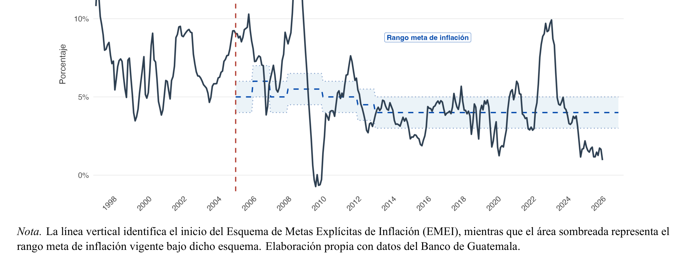
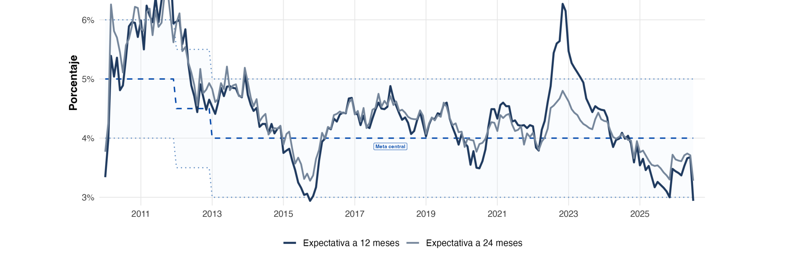
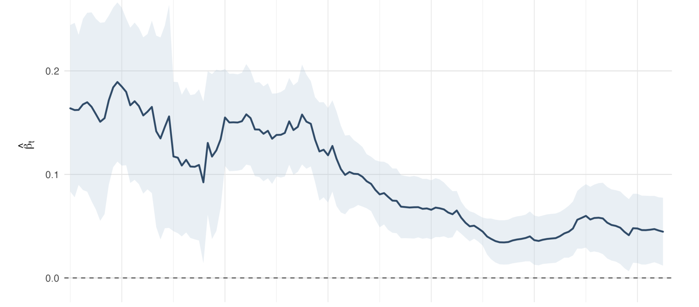
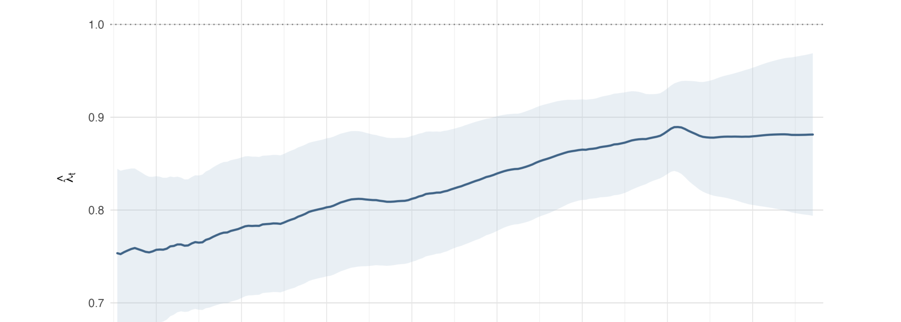
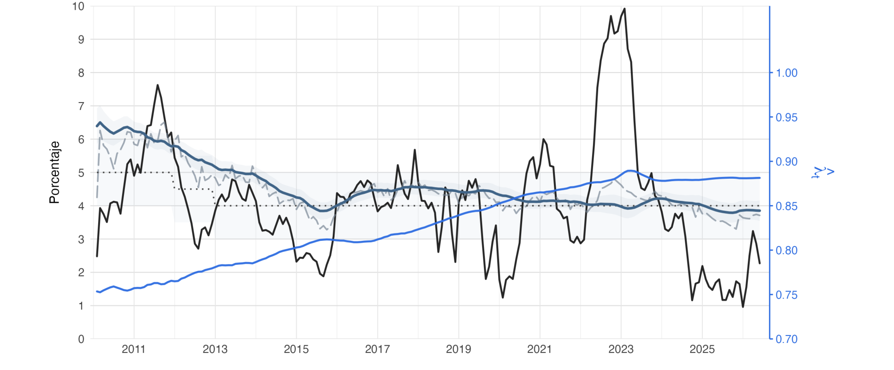
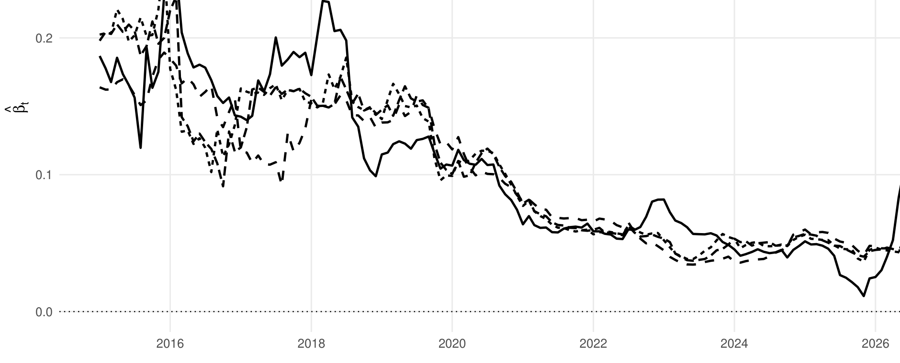

---
format:
  revealjs:
    theme: [default, custom_v5.scss]
    width: 1600
    height: 900
    margin: 0.035
    slide-number: true
    controls: false
    progress: true
    transition: fade
    background-transition: fade
    center: false
    hash: true
    history: true
    overview: true
    touch: true
    embed-resources: true
    html-math-method: mathjax
lang: es
execute:
  echo: false
  warning: false
  message: false
---

## {.institutional-cover}

Presentación final · Working paper

Evolución del anclaje de las expectativas de inflación en Guatemala

Una aproximación a la credibilidad de la política monetaria · 2010–2026

Paulo Garrido

Programa de Estudios Superiores en Banca Central Maestría en Economía y Finanzas Aplicadas

Seminario de investigación · Economía y Finanzas Aplicadas

::: {.notes}
**Tiempo: 0:30.** Abrir con tono de seminario. El objetivo no es presentar una tesis completa, sino el argumento central del working paper.
:::

## La credibilidad se observa cuando la inflación se desvía

Motivación

La pregunta no es solo si la inflación vuelve a la meta.

La cuestión económica relevante es si un choque inflacionario contamina la referencia de mediano plazo que usan los agentes para formar expectativas.

El episodio 2021–2023 funciona como una prueba de esfuerzo del anclaje en Guatemala.

Fuente: elaboración propia con datos del Banco de Guatemala.

 Anclaje de expectativas en Guatemala · Working paper

::: {.notes}
**Tiempo: 1:00.** Presentar la intuición: el régimen es creíble si los choques de corto plazo no modifican persistentemente la referencia nominal de mediano plazo.
:::

## Un mismo fenómeno, dos preguntas distintas

Problema económico

01

Intensidad del anclaje

¿Cuánto reacciona la expectativa a 24 meses frente a la inflación observada?

02

Localización del ancla

¿Alrededor de qué nivel de inflación terminan organizándose esas expectativas?

El trabajo separa la <strong>fuerza del anclaje</strong> de la <strong>ubicación de la referencia nominal</strong>.

 Anclaje de expectativas en Guatemala · Working paper

::: {.notes}
**Tiempo: 0:55.** Esta distinción debe quedar muy clara: una expectativa puede reaccionar poco ante la inflación y, aun así, organizarse alrededor de un nivel distinto de la meta.
:::

## Pregunta central y respuesta breve

Working paper logic

¿Cómo evolucionó el anclaje de las expectativas de inflación a 24 meses en Guatemala durante 2010–2026?

El análisis distingue dos dimensiones: sensibilidad frente a la inflación observada y referencia nominal hacia la cual parecen converger las expectativas.

Respuesta breve: las expectativas a 24 meses parecen haberse vuelto <strong>menos sensibles</strong> a la inflación observada y más consistentes con una referencia nominal próxima a la meta.

 Anclaje de expectativas en Guatemala · Working paper

::: {.notes}
**Tiempo: 0:50.** Formular pregunta y dar la respuesta corta antes de entrar a metodología. Esto ayuda a la audiencia a seguir los resultados.
:::

## Aporte del trabajo

Contribución

A

Dinámica del anclaje

No se limita a observar proximidad respecto de la meta; estima cómo cambia la sensibilidad de las expectativas frente a la inflación.

B

Referencia implícita

Recupera el nivel de inflación alrededor del cual parecen converger las expectativas y lo contrasta con la meta oficial.

El aporte es distinguir si las expectativas están menos expuestas a choques inflacionarios y si esa menor sensibilidad ocurre alrededor de una referencia compatible con el objetivo anunciado.

 Anclaje de expectativas en Guatemala · Working paper

::: {.notes}
**Tiempo: 0:55.** Presentar el aporte de manera sobria: complementa la evidencia local con una aproximación dinámica de credibilidad.
:::

## Tres resultados en una mirada

Preview of results

Sensibilidad rolling

0.16 → 0.05

Menor transmisión de la brecha inflacionaria hacia expectativas a 24 meses.

Proxy de credibilidad

0.75 → 0.88

Mayor peso estimado de la referencia nominal implícita.

Ancla implícita

&gt;6% → ≈4%

Convergencia hacia niveles compatibles con la meta.

Magnitudes reportadas en la discusión de resultados del working paper.

 Anclaje de expectativas en Guatemala · Working paper

::: {.notes}
**Tiempo: 1:00.** Esta diapositiva es el mapa de resultados. No demostrar todavía; solo adelantar el hilo de la evidencia.
:::

## De la política monetaria discreta a la gestión de expectativas

Marco teórico · expectativas

Antes

La banca central como arte reservado

Menor comunicación pública y mayor discreción operativa.

Giro moderno

Expectativas como canal de transmisión

La política monetaria actúa no solo por el instrumento corriente, sino por la trayectoria esperada de inflación y tasas.

EMEI

Meta, transparencia y rendición de cuentas

El régimen de metas explícitas busca ofrecer una referencia nominal creíble para coordinar expectativas.

En esta literatura, la credibilidad se manifiesta cuando la meta anunciada conserva poder informativo aun en presencia de choques inflacionarios.

Referencias conceptuales: Woodford (2001, 2003), Bernanke & Mishkin (1997), Mishkin (2007).

 Anclaje de expectativas en Guatemala · Working paper

::: {.notes}
**Tiempo: 1:05.** No presentar una revisión exhaustiva; explicar la evolución conceptual que justifica estudiar expectativas.
:::

## El anclaje no es una variable observable

Marco teórico · medición

<h3>Proximidad</h3>

¿Qué tan cerca están las expectativas de la meta central?

<h3>Estabilidad</h3>

¿Se mantienen relativamente contenidas ante perturbaciones?

<h3>Sensibilidad</h3>

¿Cuánto se trasladan los movimientos de inflación reciente hacia el horizonte de 24 meses?

<h3>Convergencia</h3>

¿Hacia qué referencia nominal parecen organizarse las expectativas?

El estudio usa proximidad y estabilidad como señales descriptivas, pero centra la identificación econométrica en sensibilidad y convergencia.

Literatura relacionada: Levin et al. (2004), Ehrmann (2015), Łyziak & Paloviita (2017), Bems et al. (2021), Mehrotra & Yetman (2018).

 Anclaje de expectativas en Guatemala · Working paper

::: {.notes}
**Tiempo: 1:05.** Explicar por qué no basta con decir que las expectativas están dentro de la banda. La medición requiere inferir huellas observables del anclaje.
:::

## Qué significa ganar credibilidad en el modelo

Marco conceptual operativo

$$
\bar e^{24}_t = \underbrace{\lambda_t\pi_t^*}_{\text{referencia nominal}} + \underbrace{(1-\lambda_t)\bar\pi_t}_{\text{inflación observada}}
$$

$\lambda_t \uparrow$

La inflación reciente pierde peso en la formación de expectativas.

$\pi_t^* \rightarrow \pi_t^m$

La referencia implícita se aproxima al objetivo anunciado por la autoridad monetaria.

Mayor credibilidad requiere ambas dimensiones: <strong>menor sensibilidad</strong> y <strong>ancla compatible con la meta</strong>.

Marco conceptual: Bomfim & Rudebusch (2000); Demertzis, Marcellino & Viegi (2012).

 Anclaje de expectativas en Guatemala · Working paper

::: {.notes}
**Tiempo: 1:15.** Lambda cercano a uno implica mayor peso de la referencia nominal. Pi estrella no se impone igual a la meta; se estima y luego se compara.
:::

## Datos: expectativas de analistas privados a horizonte constante

Datos y período muestral

En 2022–2023, el horizonte de 12 meses reaccionó con más fuerza que el horizonte de 24 meses.

Frecuencia<strong>mensual</strong>

Muestra<strong>2010m1–2026m6</strong>

Expectativas<strong>EEE · Banguat</strong>

Inflación<strong>IPC · INE/Banguat</strong>

 Anclaje de expectativas en Guatemala · Working paper

::: {.notes}
**Tiempo: 1:10.** Subrayar que la evidencia corresponde al Panel de Analistas Privados y al horizonte constante de 24 meses.
:::

## La estrategia empírica avanza en tres pasos

Diseño empírico

1

Hechos estilizados

Proximidad a la meta, estabilidad y diferencias entre horizontes.

2

Regresiones móviles

Primera señal transparente de sensibilidad cambiante.

3

TVP–VAR + Kalman

Estimación continua de sensibilidad, $\lambda_t$ y $\pi_t^*$.

La presentación empírica pasa de una señal visual a una medida dinámica de credibilidad.

 Anclaje de expectativas en Guatemala · Working paper

::: {.notes}
**Tiempo: 0:55.** Esta diapositiva es el mapa de navegación empírico.
:::

## La sensibilidad de las expectativas cayó de 0.16 a 0.05

Resultado 1 · Regresiones móviles

0.16

promedio inicial

↓

0.05

hacia 2026

Estimación rolling con ventana de 60 meses y errores Newey–West HAC.

 Anclaje de expectativas en Guatemala · Working paper

::: {.notes}
**Tiempo: 1:30.** Primer resultado fuerte. La misma desviación de inflación respecto de la meta genera hoy un movimiento menor en las expectativas a 24 meses que al inicio de la muestra.
:::

## El TVP–VAR traduce la sensibilidad en una proxy dinámica

Especificación central

$$
\begin{aligned}
\pi_t &= a_0 + a\pi_{t-1}+be^{24}_{t-1}+\varepsilon_{\pi,t} \\
e^{24}_t &= c_{0t}+c_t\pi_{t-1}+de^{24}_{t-1}+\varepsilon_{e,t}
\end{aligned}
$$

Intensidad del anclaje
<strong>$\lambda_t=1-\dfrac{c_t}{1-d}$</strong>

Localización del ancla
<strong>$\pi_t^*=\dfrac{c_{0t}}{1-d-c_t}$</strong>

El filtro de Kalman permite que $c_{0t}$ y $c_t$ evolucionen gradualmente a lo largo del tiempo.

 Anclaje de expectativas en Guatemala · Working paper

::: {.notes}
**Tiempo: 1:15.** Mostrar la arquitectura, no derivar todo. La derivación completa queda en backup.
:::

## La proxy de credibilidad aumentó de 0.75 a 0.88

Resultado 2 · Intensidad del anclaje

0.75

inicio

↑

0.88

hacia 2026

Proxy construida a partir de los parámetros del TVP–VAR. Valores más altos indican menor dependencia de la inflación observada.

 Anclaje de expectativas en Guatemala · Working paper

::: {.notes}
**Tiempo: 1:25.** Lambda no es credibilidad observada directamente, sino una proxy dinámica. La dirección creciente es el resultado económico principal.
:::

## El ancla implícita convergió hacia niveles próximos a la meta

Resultado 3 · Localización del ancla

El ancla parte por encima de 6% y se aproxima progresivamente al entorno de 4%.

El fortalecimiento de la intensidad del anclaje coincide con una referencia implícita cada vez más consistente con la meta oficial.

Ancla implícita estimada a partir del TVP–VAR y comparada con la meta vigente.

 Anclaje de expectativas en Guatemala · Working paper

::: {.notes}
**Tiempo: 1:30.** Esta es la segunda mitad del resultado central: no solo sube lambda, sino que el ancla estimada converge hacia la meta.
:::

## 2021–2023 fue la prueba más exigente para la interpretación

Resultado 4 · Lectura conjunta

Inflación observada<strong>≈10%</strong>

Expectativa 24m<strong>reacción contenida</strong>

$\lambda_t$<strong>permanece elevada</strong>

El shock llegó a la inflación, pero no se trasladó con magnitud equivalente a la referencia de mediano plazo.

 Anclaje de expectativas en Guatemala · Working paper

::: {.notes}
**Tiempo: 1:40.** Este debe ser el clímax. Primero describir el salto inflacionario; luego enfatizar que la expectativa a 24 meses y lambda no se mueven con la misma magnitud.
:::

## Las conclusiones sobreviven a cambios razonables de especificación

Robustez y diagnósticos

✓
<strong>Ventanas alternativas</strong>36, 48, 50 y 60 meses reproducen la caída de sensibilidad.

✓
<strong>Primeras diferencias</strong>La reducción de $c_t$ se mantiene con variables estacionarias.

✓
<strong>Dinámica alternativa de inflación</strong>AR(2), AR(4) y rezago 12 mantienen prácticamente invariantes $\lambda_t$ y $\pi_t^*$.

La robustez no elimina todas las limitaciones, pero reduce la probabilidad de que el resultado central provenga de una especificación puntual.

 Anclaje de expectativas en Guatemala · Working paper

::: {.notes}
**Tiempo: 1:00.** Mantener esta diapositiva a nivel agregado. Los detalles están en backup.
:::

## Qué no afirma el trabajo

Limitaciones

No mide expectativas de todos los agentes

La evidencia corresponde al Panel de Analistas Privados.

No identifica causalidad institucional

Documenta una trayectoria compatible con mayor credibilidad; no atribuye el cambio a un único evento de política.

La ecuación auxiliar de inflación conserva autocorrelación

Se evalúa en robustez y no altera las trayectorias de interés.

 Anclaje de expectativas en Guatemala · Working paper

::: {.notes}
**Tiempo: 0:55.** Ser honesto y preciso. Esto fortalece la defensa porque separa evidencia de interpretación causal.
:::

## Conclusión central

Cierre

La evidencia es consistente con un fortalecimiento gradual del anclaje de las expectativas de inflación a 24 meses en Guatemala.

Menor sensibilidad frente a la inflación observada.

Mayor proxy de credibilidad.

Ancla implícita progresivamente más próxima a la meta.

Discusión: ¿cómo debería complementarse esta evidencia con expectativas de otros agentes y horizontes más largos?

 Anclaje de expectativas en Guatemala · Working paper

::: {.notes}
**Tiempo: 1:05.** Cerrar sin sobreafirmar. Repetir que el resultado es evidencia consistente con fortalecimiento del anclaje, no una medición directa de credibilidad total.
:::

## Gracias

Preguntas y discusión de la terna

Quedo atento a sus comentarios y preguntas.

¿Cómo complementar esta evidencia con expectativas de otros agentes y horizontes más largos?

 Anclaje de expectativas en Guatemala · Working paper

::: {.notes}
**Tiempo: 0:25.** Dejar abierta una pregunta de investigación futura para ordenar la discusión.
:::

## {.backup-cover}

Backup

Material para preguntas

Derivación, diagnósticos y robustez

 Backup · Working paper

::: {.notes}
Material de respaldo; no presentar salvo que lo pidan.
:::

## Los criterios de información favorecen la especificación variante en el tiempo

Backup · selección del modelo

<table class="model-table fragment fade-up">
<thead><tr><th></th><th>VAR</th><th>TVP–VAR</th></tr></thead>
<tbody>
<tr><td>Log-verosimilitud</td><td>−184.45</td><td class="highlight">−146.33</td></tr>
<tr><td>AIC</td><td>384.89</td><td class="highlight">312.67</td></tr>
<tr><td>BIC</td><td>411.16</td><td class="highlight">345.50</td></tr>
</tbody>
</table>

Los tres criterios favorecen permitir variación temporal en la ecuación de expectativas.

 Backup · Working paper

## El parámetro $c_t$ confirma una reducción gradual de la sensibilidad

Backup · sensibilidad variante en el tiempo

0.18

inicio de muestra

↓

0.09

final del período

Estimaciones suavizadas del TVP–VAR mediante filtro de Kalman.

 Backup · Working paper

## Derivación de $\lambda_t$ y $\pi_t^*$

Backup metodológico

$$
\bar e^{24}_t = \frac{c_{0t}}{1-d}+\frac{c_t}{1-d}\bar\pi_t
$$

$$
\bar e^{24}_t = \lambda_t\pi_t^*+(1-\lambda_t)\bar\pi_t
$$

$$
\lambda_t=1-\frac{c_t}{1-d},\qquad \pi_t^*=\frac{c_{0t}}{1-d-c_t}
$$

La identificación empírica separa la intensidad del anclaje de la localización de la referencia nominal.

 Backup · Working paper

## Persistencia de las expectativas en regresiones móviles

Backup · rolling regressions

Las expectativas conservan persistencia, pero la sensibilidad frente a nueva información inflacionaria se reduce.

 Backup · Working paper

## Robustez de ventanas móviles

Backup · ventanas alternativas

Las ventanas de 36, 48, 50 y 60 meses reproducen la reducción general de $\beta_t$.

 Backup · Working paper

## Robustez en primeras diferencias

Backup · estacionariedad

La sensibilidad cae de aproximadamente 0.37 a 0.12, reduciendo la posibilidad de una relación inducida por persistencia en niveles.

 Backup · Working paper

## Robustez ante dinámica alternativa de inflación

Backup · diagnóstico del TVP–VAR

<table class="model-table compact fragment fade-up">
<thead><tr><th>Especificación</th><th>$\lambda$ final</th><th>$\pi^*$ final</th><th>Corr. $\lambda$</th><th>Corr. $\pi^*$</th></tr></thead>
<tbody>
<tr><td>Modelo base</td><td>0.881</td><td>3.851</td><td>1.000</td><td>1.000</td></tr>
<tr><td>Inflación AR(2)</td><td>0.901</td><td>3.806</td><td>0.987</td><td>0.979</td></tr>
<tr><td>Inflación AR(4)</td><td>0.882</td><td>3.850</td><td>1.000</td><td>0.999</td></tr>
<tr><td>Inflación AR(1)+rezago 12</td><td>0.888</td><td>3.836</td><td>0.997</td><td>0.999</td></tr>
</tbody>
</table>

Aunque la autocorrelación residual de inflación persiste, las trayectorias centrales permanecen prácticamente invariantes.

 Backup · Working paper

## Definición operativa de variables

Backup · datos

<table class="model-table compact fragment fade-up">
<thead><tr><th>Variable</th><th>Unidad</th><th>Fuente</th></tr></thead>
<tbody>
<tr><td>Expectativa de inflación a 24 meses</td><td>Porcentaje</td><td>Banco de Guatemala</td></tr>
<tr><td>Expectativa de inflación a 12 meses</td><td>Porcentaje</td><td>Banco de Guatemala</td></tr>
<tr><td>Inflación observada</td><td>Variación interanual</td><td>INE / Banco de Guatemala</td></tr>
<tr><td>Meta central de inflación</td><td>Porcentaje</td><td>Banco de Guatemala</td></tr>
</tbody>
</table>

El análisis se expresa en términos de desviaciones respecto de la meta vigente cuando corresponde.

 Backup · Working paper

