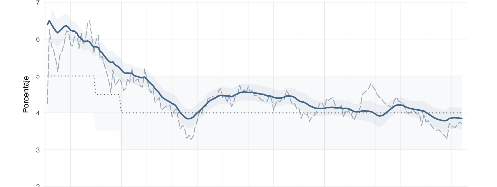
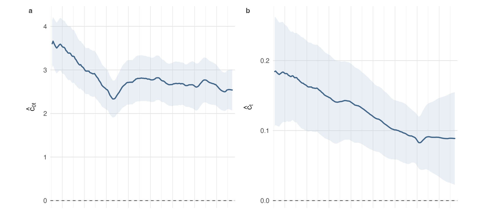
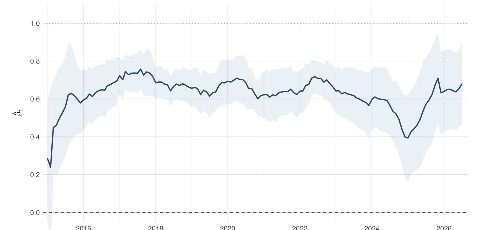
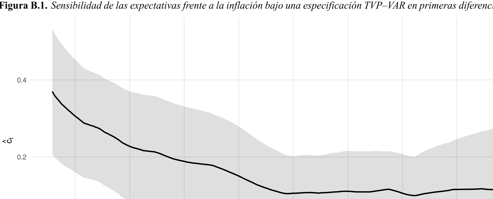

---
format:
  revealjs:
    theme: [default, custom_v9.scss]
    width: 1600
    height: 900
    margin: 0.035
    slide-number: true
    controls: false
    progress: true
    transition: fade
    background-transition: fade
    center: false
    hash: true
    history: true
    overview: true
    touch: true
    embed-resources: true
    html-math-method: mathjax
lang: es
execute:
  echo: false
  warning: false
  message: false
---

## {.institutional-cover}

Seminario de investigación · Working paper

Evolución del anclaje de las expectativas de inflación en Guatemala

Una aproximación a la credibilidad de la política monetaria · 2010–2026

<strong>Paulo Garrido</strong>

Maestría en Economía y Finanzas Aplicadas

Programa de Estudios Superiores en Banca Central

Seminario de investigación · Economía y Finanzas Aplicadas

::: {.notes}
**Tiempo: 0:30.** Abrir con tono de seminario. El objetivo no es presentar una tesis completa, sino el argumento central del working paper.
:::

## Por qué estudiar el anclaje de las expectativas

Motivación

01

La efectividad de la política monetaria moderna depende, en buena medida, de la capacidad del banco central para mantener las expectativas de inflación bien ancladas.

02

Después de más de dos décadas de EMEI en Guatemala, interesa examinar la credibilidad como un proceso dinámico que se construye y evoluciona gradualmente a través del tiempo.

03

Responderlo exige distinguir dos dimensiones complementarias: qué tan fuerte es el anclaje y hacia qué referencia nominal convergen las expectativas.

La pregunta no es solo si la inflación vuelve a la meta, sino si la meta se ha convertido efectivamente en la referencia que orienta las expectativas de mediano plazo.

 Anclaje de expectativas en Guatemala · Working paper

::: {.notes}
**Tiempo: 1:05.** La motivación no es únicamente describir expectativas. Es evaluar si la credibilidad monetaria puede verse como un proceso dinámico bajo el EMEI.
:::

## Dos dimensiones del anclaje, una evolución dinámica

Problema económico

01

Intensidad — ¿qué tan fuerte?

¿Cuánto se trasladan las variaciones de la inflación observada hacia las expectativas a 24 meses?

02

Localización — ¿hacia dónde?

¿Hacia qué referencia nominal implícita convergen las expectativas y qué tan próxima es esa referencia a la meta oficial?

Ambas dimensiones pueden evolucionar en el tiempo; por ello, el trabajo examina conjuntamente su trayectoria durante 2010–2026.

 Anclaje de expectativas en Guatemala · Working paper

::: {.notes}
**Tiempo: 0:55.** Esta distinción debe quedar clara: una expectativa puede estar relativamente cerca de la meta, reaccionar poco ante la inflación y aun así organizarse alrededor de una referencia distinta del objetivo oficial.
:::

## Planteamiento económico y pregunta central

Working paper logic

Que las expectativas permanezcan próximas a la meta no implica necesariamente que estén bien ancladas.

Un anclaje creíble debería manifestarse, además, en una menor sensibilidad de las expectativas de mediano plazo frente a perturbaciones inflacionarias y en su convergencia hacia una referencia nominal compatible con la meta.

¿Cómo evolucionó el anclaje de las expectativas de inflación a 24 meses en Guatemala durante 2010–2026, tanto en su intensidad como en la referencia nominal hacia la cual convergen?

 Anclaje de expectativas en Guatemala · Working paper

::: {.notes}
**Tiempo: 0:55.** Plantear la pregunta sin adelantar todavía toda la respuesta. La respuesta breve aparecerá como mapa de resultados.
:::

## Aporte del trabajo

Contribución

El trabajo caracteriza el anclaje de las expectativas en Guatemala como un proceso dinámico y multidimensional, distinguiendo entre la intensidad del anclaje y la referencia nominal hacia la cual convergen las expectativas.

01

Dos dimensiones

Evalúa conjuntamente la <strong>intensidad del anclaje</strong> y la <strong>referencia nominal</strong> hacia la cual convergen las expectativas.

02

Ancla inflacionaria implícita

Recupera una <strong>referencia nominal implícita</strong> y permite contrastarla con la <strong>meta oficial de inflación</strong>.

03

Evolución temporal

Permite que ambas dimensiones <strong>cambien en el tiempo</strong>, interpretando el anclaje como un <strong>proceso gradual</strong>.

 Anclaje de expectativas en Guatemala · Working paper

::: {.notes}
**Tiempo: 1:00.** No presentar TVP–VAR y Kalman como el aporte en sí mismo. Son las herramientas para operacionalizar el aporte.
:::

## Tres resultados en una mirada

Preview of results

Sensibilidad rolling

0.16 → 0.05

Menor transmisión de la brecha inflacionaria hacia expectativas a 24 meses.

Proxy de credibilidad

0.75 → 0.88

Mayor peso estimado de la referencia nominal implícita.

Ancla inflacionaria implícita

&gt;6% → ≈4%

Convergencia hacia niveles compatibles con la meta.

Magnitudes reportadas en la discusión de resultados del working paper.

 Anclaje de expectativas en Guatemala · Working paper

::: {.notes}
**Tiempo: 1:00.** Esta diapositiva es el mapa de resultados. No demostrar todavía; solo adelantar el hilo de la evidencia.
:::

## Qué significa que las expectativas estén ancladas

Marco teórico · medición

En un régimen monetario creíble, las perturbaciones inflacionarias de corto plazo no deberían modificar persistentemente la referencia que orienta las expectativas de mediano plazo.

<h3>Proximidad</h3>

¿Qué tan cerca están las expectativas de la meta central?

<h3>Estabilidad</h3>

¿Se mantienen relativamente contenidas ante perturbaciones?

<h3>Sensibilidad</h3>

¿Cuánto se trasladan los movimientos de inflación reciente hacia el horizonte de 24 meses?

<h3>Convergencia</h3>

¿Hacia qué referencia nominal parecen organizarse las expectativas?

Para este trabajo, las dimensiones centrales son <strong>sensibilidad</strong> y <strong>convergencia</strong>.

Literatura relacionada: Levin et al. (2004), Ehrmann (2015), Łyziak & Paloviita (2017), Bems et al. (2021), Mehrotra & Yetman (2018).

 Anclaje de expectativas en Guatemala · Working paper

::: {.notes}
**Tiempo: 1:10.** Explicar por qué no basta con observar que las expectativas están cerca de la meta. El anclaje debe inferirse a través de señales observables.
:::

## Credibilidad como proceso dinámico

Marco conceptual operativo

$$
\bar e^{24}_t = \underbrace{\lambda_t\pi_t^*}_{\text{referencia nominal}} + \underbrace{(1-\lambda_t)\bar\pi_t}_{\text{inflación observada}}
$$

Proxy de credibilidad $\lambda_t$

Mide el peso relativo de la referencia nominal frente a la inflación observada.

Ancla inflacionaria implícita $\pi_t^*$

Indica alrededor de qué nivel de inflación se organizan las expectativas.

Si la credibilidad se construye gradualmente, tanto la fuerza del anclaje como su referencia nominal pueden cambiar en el tiempo.

Marco conceptual: Bomfim & Rudebusch (2000); Demertzis, Marcellino & Viegi (2012).

 Anclaje de expectativas en Guatemala · Working paper

::: {.notes}
**Tiempo: 1:15.** Lambda cercano a uno implica mayor peso de la referencia nominal. Pi estrella no se impone igual a la meta; se estima y luego se compara.
:::

## Datos: expectativas de inflación a 12 y 24 meses

Datos y período muestral

En 2022–2023, el horizonte de 12 meses reaccionó con más fuerza que el horizonte de 24 meses.

Variable central<strong>expectativa 24 meses</strong>

Frecuencia<strong>mensual</strong>

Muestra<strong>2010m1–2026m6</strong>

Fuente<strong>EEE · Banguat</strong>

 Anclaje de expectativas en Guatemala · Working paper

::: {.notes}
**Tiempo: 1:10.** La expectativa a 24 meses es la variable central. La expectativa a 12 meses sirve como contraste descriptivo para mostrar diferencias por horizonte.
:::

## La estrategia empírica avanza de una señal descriptiva a una medida dinámica

Diseño empírico

1

Caracterizar

<strong>Hechos estilizados.</strong> Proximidad a la meta, diferencias entre horizontes y comportamiento durante episodios inflacionarios.

2

Medir sensibilidad

<strong>Regresiones móviles.</strong> Estimar cómo cambia la respuesta de las expectativas a 24 meses frente a la inflación observada.

3

Recuperar dimensiones

<strong>TVP–VAR + Kalman.</strong> Recuperar la proxy de credibilidad y el ancla inflacionaria implícita permitiendo variación temporal en la ecuación de expectativas.

Cada etapa añade información: de observar el fenómeno, a medir su sensibilidad y finalmente reconstruir su intensidad y localización a través del tiempo.

 Anclaje de expectativas en Guatemala · Working paper

::: {.notes}
**Tiempo: 0:55.** Esta diapositiva es el mapa de navegación empírico. Presentar la estrategia como una secuencia, no como lista de técnicas.
:::

## Regresiones móviles: primera señal de sensibilidad

Especificación auxiliar

$$
\widetilde e^{24}_{\tau}=\alpha_t+\rho_t\widetilde e^{24}_{\tau-1}+\beta_t\widetilde\pi_{\tau-1}+u_{\tau},\qquad \tau\in\mathcal W_t
$$

$\widetilde e^{24}_{\tau}$<strong>expectativa a 24 meses</strong><em>expresada como desviación</em>

$\widetilde\pi_{\tau-1}$<strong>inflación observada rezagada</strong><em>expresada como desviación</em>

$\mathcal W_t$<strong>ventana móvil asociada a $t$</strong><em>estimación local de 60 meses</em>

Ventana

60 meses

Estimaciones locales a lo largo del período muestral.

Persistencia

$\rho_t$

Captura la inercia de las expectativas a 24 meses.

Sensibilidad

$\beta_t$

Mide cuánto se transmite la inflación observada hacia el horizonte de 24 meses.

Una reducción persistente de $\beta_t$ indica menor transmisión de la inflación observada hacia las expectativas de mediano plazo.

 Anclaje de expectativas en Guatemala · Working paper

::: {.notes}
**Tiempo: 1:15.** Explicar que las variables con tilde están expresadas como desviaciones. Esta especificación no entrega aún el ancla inflacionaria implícita; sirve como primera evidencia dinámica sobre la sensibilidad del horizonte de 24 meses.
:::

## Modelo central: TVP–VAR con parámetros variantes

Especificación central

$$
\begin{aligned}
\pi_t &= a_0+a\pi_{t-1}+be^{24}_{t-1}+\varepsilon_{\pi,t} \\
e^{24}_t &= c_{0t}+c_t\pi_{t-1}+de^{24}_{t-1}+\varepsilon_{e,t}
\end{aligned}
$$

Parámetros variantes

$c_{0t}$ y $c_t$

Permiten que la ecuación de expectativas cambie gradualmente en el tiempo.

Dinámica estimada

Filtro de Kalman

Recupera trayectorias suavizadas para interpretar la evolución del anclaje.

El modelo no impone que el ancla coincida con la meta; permite estimar la referencia nominal implícita y contrastarla con el objetivo oficial.

 Anclaje de expectativas en Guatemala · Working paper

::: {.notes}
**Tiempo: 1:10.** Enfatizar que el segundo renglón es el núcleo: la relación entre inflación pasada y expectativas puede variar por medio de c_t, y el intercepto variante permite recuperar la localización del ancla.
:::

## Equilibrio condicional de la ecuación de expectativas

Modelo central · paso 1

Ecuación estimada

La ecuación de expectativas del TVP–VAR permite que el intercepto y la sensibilidad frente a la inflación observada cambien en el tiempo:

$$
e^{24}_t=c_{0t}+c_t\pi_{t-1}+de^{24}_{t-1}+\varepsilon_{e,t}
$$

Condición de equilibrio

Para cada período, se consideran temporalmente fijos $c_{0t}$ y $c_t$, con perturbaciones nulas y estado estacionario condicional:

$$
e^{24}_t=e^{24}_{t-1}=\bar e^{24}_t,\qquad \pi_t=\pi_{t-1}=\bar\pi_t
$$

Relación de equilibrio asociada a los parámetros vigentes

$$
\bar e^{24}_t=\frac{c_{0t}}{1-d}+\frac{c_t}{1-d}\bar\pi_t
$$

No se asume que la economía esté permanentemente en equilibrio; se obtiene la relación de largo plazo implícita en los parámetros estimados en cada momento.

 Anclaje de expectativas en Guatemala · Working paper

::: {.notes}
**Tiempo: 1:10.** Aclarar que este es un equilibrio condicional asociado al modelo estimado para cada fecha. Esta relación prepara la recuperación de lambda y pi estrella.
:::

## Proxy de credibilidad y ancla inflacionaria implícita

Modelo central · paso 2

Relación de equilibrio del TVP–VAR

$$
\bar e^{24}_t=\frac{c_{0t}}{1-d}+\frac{c_t}{1-d}\bar\pi_t
$$

≡

Representación de credibilidad

$$
\bar e^{24}_t=\lambda_t\pi_t^*+(1-\lambda_t)\bar\pi_t
$$

Proxy de credibilidad

$\lambda_t$

$\lambda_t=1-\dfrac{c_t}{1-d}$

Valores más altos indican menor peso de la inflación observada y mayor peso de la referencia nominal implícita.

Ancla inflacionaria implícita

$\pi_t^*$

$\pi_t^*=\dfrac{c_{0t}}{1-d-c_t}$

Indica el nivel de inflación alrededor del cual se organizan las expectativas de mediano plazo.

La comparación de coeficientes permite distinguir la fuerza del anclaje de la ubicación de la referencia nominal implícita.

 Anclaje de expectativas en Guatemala · Working paper

::: {.notes}
**Tiempo: 1:20.** Mostrar que lambda y pi estrella no se imponen, sino que se recuperan al comparar la relación de equilibrio del modelo con la representación conceptual de credibilidad.
:::

## {.result-section}

Resultados principales e interpretación económica

Menor sensibilidad, mayor proxy de credibilidad y convergencia del ancla inflacionaria implícita hacia la meta.

 Anclaje de expectativas en Guatemala · Working paper

::: {.notes}
**Tiempo: 0:20.** Pausa breve para anunciar que empieza el bloque principal de resultados.
:::

## La sensibilidad de las expectativas cayó de 0.16 a 0.05

Resultado 1 · Regresiones móviles

0.16

promedio inicial

↓

0.05

hacia 2026

<strong>Interpretación económica:</strong> se redujo la transmisión de la inflación observada hacia las expectativas de mediano plazo.

Estimación rolling con ventana de 60 meses y errores Newey–West HAC.

 Anclaje de expectativas en Guatemala · Working paper

::: {.notes}
**Tiempo: 1:30.** Primer resultado fuerte. La misma desviación de inflación respecto de la meta genera hoy un movimiento menor en las expectativas a 24 meses que al inicio de la muestra.
:::

## La proxy de credibilidad aumentó de 0.75 a 0.88

Resultado 2 · Proxy de credibilidad

0.75

inicio

↑

0.88

hacia 2026

<strong>Interpretación económica:</strong> aumentó el peso estimado de la referencia nominal implícita frente al de la inflación observada, consistente con un fortalecimiento del anclaje.

Proxy construida a partir de los parámetros del TVP–VAR. Valores más altos indican menor dependencia de la inflación observada.

 Anclaje de expectativas en Guatemala · Working paper

::: {.notes}
**Tiempo: 1:25.** Lambda no es credibilidad observada directamente, sino una proxy dinámica. La dirección creciente es el resultado económico principal.
:::

## El ancla inflacionaria implícita convergió hacia niveles próximos a la meta {.ancla-slide}

Resultado 3 · Ancla inflacionaria implícita

<strong>Interpretación económica:</strong> el fortalecimiento del anclaje ocurrió alrededor de una referencia nominal cada vez más próxima a la meta oficial.

Ancla inflacionaria implícita estimada a partir del TVP–VAR y comparada con la meta vigente.

 Anclaje de expectativas en Guatemala · Working paper

::: {.notes}
**Tiempo: 1:30.** Esta es la segunda mitad del resultado central: no solo sube lambda, sino que el ancla estimada converge hacia la meta.
:::

## 2021–2023 fue la prueba más exigente para la interpretación

Resultado 4 · Lectura conjunta

Inflación observada<strong>≈10%</strong>

Expectativa 24m<strong>reacción contenida</strong>

$\lambda_t$<strong>permanece elevada</strong>

<strong>Interpretación económica:</strong> ante el mayor choque inflacionario de la muestra, las expectativas de mediano plazo reaccionaron mucho menos que la inflación observada, coherente con un anclaje más resistente.

 Anclaje de expectativas en Guatemala · Working paper

::: {.notes}
**Tiempo: 1:40.** Este debe ser el clímax. Primero describir el salto inflacionario; luego enfatizar que la expectativa a 24 meses y lambda no se mueven con la misma magnitud.
:::

## Los resultados principales son robustos a cambios razonables de especificación

Robustez y diagnósticos

✓
<strong>Ventanas alternativas</strong>Las ventanas de 36, 48, 50 y 60 meses reproducen la reducción de la sensibilidad.

✓
<strong>Primeras diferencias</strong>La reducción de la sensibilidad se mantiene al estimar el modelo en primeras diferencias, reduciendo la preocupación por relaciones inducidas por la persistencia de las series.

✓
<strong>Dinámica alternativa de inflación</strong>Especificaciones AR(2), AR(4) y AR(1) con rezago 12 preservan prácticamente las trayectorias centrales de ambas magnitudes.

En conjunto, los resultados centrales no dependen de una única elección de ventana, del uso de las variables en niveles ni de una especificación particular de la dinámica de inflación.

 Anclaje de expectativas en Guatemala · Working paper

::: {.notes}
**Tiempo: 1:05.** Mantener esta diapositiva a nivel agregado. Los detalles están en backup.
:::

## Alcances y limitaciones

Limitaciones

Cobertura de las expectativas

La evidencia corresponde al Panel de Analistas Privados; por tanto, los resultados no necesariamente representan expectativas de hogares, empresas u otros agentes.

Interpretación, no causalidad

El trabajo identifica una trayectoria compatible con un fortalecimiento de la credibilidad, pero no atribuye ese proceso causalmente a una medida, reforma o evento específico de política monetaria.

Diagnóstico del modelo

La ecuación auxiliar de inflación conserva autocorrelación residual; los ejercicios de robustez muestran que esta no altera sustancialmente las trayectorias centrales de ambas magnitudes.

 Anclaje de expectativas en Guatemala · Working paper

::: {.notes}
**Tiempo: 0:55.** Ser honesto y preciso. Esto fortalece la defensa porque separa evidencia de interpretación causal.
:::

## Conclusiones: un fortalecimiento gradual del anclaje

Cierre

La evidencia es consistente con una transformación gradual del proceso de formación de expectativas a 24 meses en Guatemala: se redujo la transmisión de la inflación observada hacia las expectativas de mediano plazo y, simultáneamente, la referencia nominal implícita se aproximó a la meta oficial.

<strong>01 · Sensibilidad</strong> Las expectativas de mediano plazo se volvieron progresivamente menos sensibles a perturbaciones de la inflación corriente.

<strong>02 · Ancla inflacionaria implícita</strong> El fortalecimiento ocurrió alrededor de una referencia cada vez más compatible con la meta oficial.

<strong>03 · 2021–2023</strong> El episodio reciente refuerza la interpretación: la inflación aumentó con fuerza, pero el horizonte de 24 meses reaccionó de forma contenida.

En conjunto, los resultados son compatibles con una consolidación gradual de la credibilidad monetaria, más que con un cambio discreto o puntual.

 Anclaje de expectativas en Guatemala · Working paper

::: {.notes}
**Tiempo: 1:15.** Cerrar sin sobreafirmar. Repetir que el resultado es evidencia consistente con fortalecimiento del anclaje, no una medición directa de credibilidad total.
:::

## Gracias

Preguntas y discusión de la terna

Quedo atento a sus comentarios y preguntas.

¿Cómo complementar esta evidencia con expectativas de otros agentes y horizontes más largos?

 Anclaje de expectativas en Guatemala · Working paper

::: {.notes}
**Tiempo: 0:25.** Dejar abierta una pregunta de investigación futura para ordenar la discusión.
:::
## {.backup-cover}

Backup

Material para preguntas

Derivación, diagnósticos y robustez

 Backup · Working paper

::: {.notes}
Material de respaldo; no presentar salvo que lo pidan.
:::

## Los criterios de información favorecen la especificación variante en el tiempo

Backup · selección del modelo

<table class="model-table fragment fade-up">
<thead><tr><th></th><th>VAR</th><th>TVP–VAR</th></tr></thead>
<tbody>
<tr><td>Log-verosimilitud</td><td>−184.45</td><td class="highlight">−146.33</td></tr>
<tr><td>AIC</td><td>384.89</td><td class="highlight">312.67</td></tr>
<tr><td>BIC</td><td>411.16</td><td class="highlight">345.50</td></tr>
</tbody>
</table>

Los tres criterios favorecen permitir variación temporal en la ecuación de expectativas.

 Backup · Working paper

## El parámetro $c_t$ confirma una reducción gradual de la sensibilidad

Backup · sensibilidad variante en el tiempo

0.18

inicio de muestra

↓

0.09

final del período

Estimaciones suavizadas del TVP–VAR mediante filtro de Kalman.

 Backup · Working paper

## Derivación completa de $\lambda_t$ y $\pi_t^*$

Backup metodológico

$$
e^{24}_t=c_{0t}+c_t\pi_{t-1}+de^{24}_{t-1}+\varepsilon_{e,t}
$$
$$
\varepsilon_{e,t}=0,\quad e^{24}_t=e^{24}_{t-1}=\bar e^{24}_t,\quad \pi_t=\pi_{t-1}=\bar\pi_t
$$
$$
\bar e^{24}_t = \frac{c_{0t}}{1-d}+\frac{c_t}{1-d}\bar\pi_t
$$
$$
\bar e^{24}_t = \lambda_t\pi_t^*+(1-\lambda_t)\bar\pi_t
$$
$$
\lambda_t=1-\frac{c_t}{1-d},\qquad \pi_t^*=\frac{c_{0t}}{1-d-c_t}
$$

El equilibrio es condicional a los parámetros vigentes en cada período; no supone que la economía permanezca siempre en equilibrio efectivo.

 Backup · Working paper

## Persistencia de las expectativas en regresiones móviles

Backup · rolling regressions

Las expectativas conservan persistencia, pero la sensibilidad frente a nueva información inflacionaria se reduce.

 Backup · Working paper

## Robustez de ventanas móviles

Backup · ventanas alternativas

Las ventanas de 36, 48, 50 y 60 meses reproducen la reducción general de $\beta_t$.

 Backup · Working paper

## Robustez en primeras diferencias

Backup · estacionariedad

La sensibilidad cae de aproximadamente 0.37 a 0.12, reduciendo la posibilidad de una relación inducida por persistencia en niveles.

 Backup · Working paper

## Robustez ante dinámica alternativa de inflación

Backup · diagnóstico del TVP–VAR

<table class="model-table compact fragment fade-up">
<thead><tr><th>Especificación</th><th>$\lambda$ final</th><th>$\pi^*$ final</th><th>Corr. $\lambda$</th><th>Corr. $\pi^*$</th></tr></thead>
<tbody>
<tr><td>Modelo base</td><td>0.881</td><td>3.851</td><td>1.000</td><td>1.000</td></tr>
<tr><td>Inflación AR(2)</td><td>0.901</td><td>3.806</td><td>0.987</td><td>0.979</td></tr>
<tr><td>Inflación AR(4)</td><td>0.882</td><td>3.850</td><td>1.000</td><td>0.999</td></tr>
<tr><td>Inflación AR(1)+rezago 12</td><td>0.888</td><td>3.836</td><td>0.997</td><td>0.999</td></tr>
</tbody>
</table>

Aunque la autocorrelación residual de inflación persiste, las trayectorias centrales permanecen prácticamente invariantes.

 Backup · Working paper

## Definición operativa de variables

Backup · datos

<table class="model-table compact fragment fade-up">
<thead><tr><th>Variable</th><th>Unidad</th><th>Fuente</th></tr></thead>
<tbody>
<tr><td>Expectativa de inflación a 24 meses</td><td>Porcentaje</td><td>Banco de Guatemala</td></tr>
<tr><td>Expectativa de inflación a 12 meses</td><td>Porcentaje</td><td>Banco de Guatemala</td></tr>
<tr><td>Inflación observada</td><td>Variación interanual</td><td>INE / Banco de Guatemala</td></tr>
<tr><td>Meta central de inflación</td><td>Porcentaje</td><td>Banco de Guatemala</td></tr>
</tbody>
</table>

El análisis se expresa en términos de desviaciones respecto de la meta vigente cuando corresponde.

 Backup · Working paper

